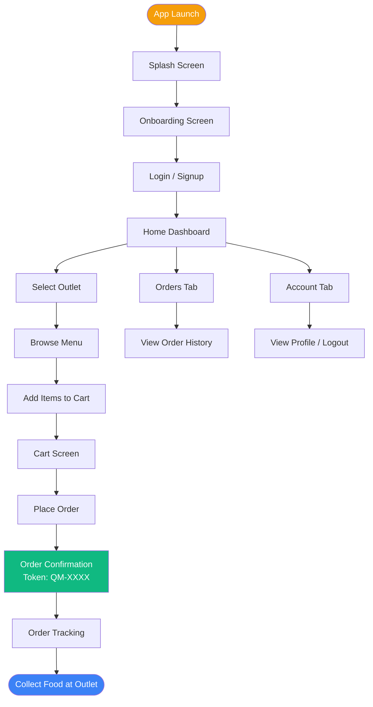

# QManage – Full Report Content (KaamKaaz Style)

---

## INTRODUCTION OF THE APPLICATION

QManage is a campus-focused food queue management and ordering application built natively for Android. The application was developed to address a specific and recurring pain point in university environments: the inefficiency of physical queuing at campus food outlets during peak hours. Rather than requiring students to travel to an outlet, stand in queue, and wait for their food — all during a limited lunch or break window — QManage allows the entire experience to be managed from a smartphone.

The application provides a two-sided interaction model. Students use the QManage app to browse open outlets, view live menu items, add products to a cart, and place an order directly from their phone. The backend, built using Node.js and MySQL, processes each order and returns a unique queue token number. The student then visits the outlet only when their order is confirmed and ready for pickup, eliminating needless waiting.

At the infrastructure level, QManage is built on a full-stack architecture. The Android frontend communicates with a RESTful Node.js API server over HTTP, with all persistent data stored in a structured MySQL relational database. The data layer includes five normalized tables — `users`, `outlets`, `menu_items`, `orders`, and `order_items` — all linked through foreign key constraints to ensure data integrity. This architecture was chosen for its scalability, clarity, and practical relevance to real-world industry development practices.

---

## MOTIVATION OF THE APPLICATION

The idea for QManage emerged directly from an everyday observation on the BML Munjal University campus. During peak meal times, queues at the campus cafeteria, food court, and juice bar would grow beyond 15-20 students. Students attending back-to-back classes often had fewer than 30 minutes for lunch, yet a significant portion of that time was spent simply waiting in line. The problem was not a lack of food options, but a lack of coordination and digital visibility between the student and the outlet.

The challenge facing the student is twofold. First, they have no way of knowing how long a queue is before physically going to the outlet. Second, once they place an order, they must stand in place and wait without any way to be notified when their item is ready. The challenge facing the outlet operator is equally significant: they receive a flood of orders simultaneously, with no structured way to assign priority or manage token-based pickups.

QManage was built to solve both sides of this problem with a single application. The student gains the ability to see which outlets are currently open, how many people are in the queue, what the expected wait time is, and what menu items are available — all before leaving their seat. By placing an order through the app and receiving a token number, the student is given a guaranteed place in the queue without being physically present. The outlet operator benefits from a structured, database-backed order pipeline that ensures fairness and traceability.

Beyond solving an immediate inconvenience, QManage also served as a pedagogical exercise in building a production-quality Android application backed by a real, live database. Every feature in the application — from login to checkout — communicates with a MySQL server, and no dummy data is displayed at any point in the final product. This gave the development team hands-on experience in full-stack mobile development, RESTful API design, database schema normalization, and Android lifecycle management.

---

## USE OF THE APPLICATION

QManage operates around a single primary user role — the Campus Student — and provides a streamlined set of screens designed to guide them from discovery to order confirmation with minimal friction.

**The Student Experience**

A student begins by downloading and registering on the application. The registration screen requests their full name, email address, phone number, and a password. Once registered, the student logs in and is taken directly to the Home Dashboard. The session is persisted through a SharedPreferences-backed Session Manager, which means subsequent launches of the app will skip the login screen entirely.

On the Home Dashboard, the student is greeted by their first name (e.g., "Hello, Parth!") and presented with a live list of campus outlets fetched directly from the MySQL database. Each outlet card displays the outlet's name, food categories, star rating, estimated wait time in minutes, current queue count, and an OPEN/CLOSED badge. The list is sorted by open status first, then by rating, ensuring that the most relevant outlets appear at the top. A set of filter chips (All, Burgers, Pizza, Healthy) allows the student to narrow down the list by cuisine category.

Tapping on an outlet navigates the student to the Outlet Menu screen. This screen fetches all available menu items for the selected outlet from the backend. Each item card displays the name, description, price, a veg/non-veg indicator, and an "Add" button. Tapping "Add" adds the item to a globally managed cart. The CartManager is implemented as a thread-safe Singleton that enforces a one-outlet-per-cart rule: if a student tries to add an item from a different outlet, the cart is automatically cleared and the new item is added. A floating cart bar at the bottom of the screen shows the item count and subtotal and updates in real-time with every addition.

From the cart, the student reviews their selected items, adjusts quantities, and proceeds to checkout. The checkout action sends a POST request to the backend containing the user ID, outlet ID, list of ordered items (with quantities and prices), and the total amount. The backend wraps the database insertions in a transaction, generating a unique token number in the format `QM-XXXX`. This token number is displayed prominently on the Order Confirmation screen, which the student can show at the outlet counter to collect their food.

The Orders tab at the bottom of the screen shows the student's full order history. Each past order displays the outlet name, order ID, date and time, status, and total amount. This data is fetched dynamically from the database using a JOIN query across the `orders` and `outlets` tables, ensuring that no stale or hardcoded data is ever shown.

---

## IMPORTANT JAVA LIBRARIES USED IN THE APPLICATION

*   **Retrofit 2 (`com.squareup.retrofit2:retrofit:2.9.0`)**: Retrofit is the primary networking library used in QManage. It is a type-safe REST client for Android and Java, maintained by Square. Rather than writing manual HTTP requests using `HttpURLConnection` or `OkHttp` directly, Retrofit allows API endpoints to be declared as Java interface methods with annotations such as `@GET`, `@POST`, and `@Path`. The response is automatically deserialized into Java model objects. In QManage, Retrofit handles all communication with the Node.js backend, including user authentication, outlet fetching, menu loading, order placement, and order history retrieval.

*   **Gson Converter (`com.squareup.retrofit2:converter-gson:2.9.0`)**: Gson is a Java serialization and deserialization library developed by Google. When integrated with Retrofit via the Gson Converter Factory, it automatically converts the JSON responses from the API into typed Java objects. In QManage, this eliminates all manual JSON parsing. The `@SerializedName` annotation is used extensively in model classes (e.g., `FoodItem.java`, `Order.java`) to map JSON keys that use snake_case (e.g., `outlet_id`, `is_veg`) to Java fields that use camelCase (e.g., `outletId`, `isVeg`).

*   **RecyclerView (`androidx.recyclerview:recyclerview:1.3.2`)**: RecyclerView is the standard Android component for displaying large, scrollable lists of data efficiently. Unlike a ListView, RecyclerView recycles view holders that scroll off-screen, making it highly performant even with hundreds of items. QManage uses RecyclerView in four separate contexts: the Outlet list on the Home screen, the Menu Items list on the Outlet Menu screen, the Cart items list on the Cart screen, and the Order History list on the Orders tab. Each is backed by a dedicated Adapter class.

*   **Material Components for Android (`com.google.android.material:material:1.12.0`)**: Google's Material Design library provides pre-built, styled UI components that conform to the Material Design 3 specification. In QManage, this library is used for `MaterialButton` (for login, signup, and checkout buttons), `MaterialCardView` (for outlet and food item cards), and `BottomNavigationView` (for the main navigation between the Home, Orders, and Account tabs). Using these components ensures a consistent, modern look and feel across the application.

---

## LIST OF JAVA FILES

**Activities:**
*   `SplashActivity.java` — Displays the app logo briefly and redirects to Onboarding or Login.
*   `OnboardingActivity.java` — A swipeable onboarding screen shown on first launch.
*   `LoginActivity.java` — Handles email/password authentication against the backend API.
*   `SignupActivity.java` — Handles new user registration with name, email, phone, and password.
*   `MainActivity.java` — The host activity for the Bottom Navigation View; manages `HomeFragment`, `OrdersFragment`, and `AccountFragment`.
*   `OutletMenuActivity.java` — Fetches and displays the menu items for a selected outlet; manages the cart bar.
*   `CartActivity.java` — Displays cart contents with quantity controls and handles the checkout API call.
*   `OrderConfirmationActivity.java` — Displays the generated token number upon successful order placement.
*   `OrderTrackingActivity.java` — Simulates order status tracking with an animated progress indicator.

**Fragments:**
*   `HomeFragment.java` — Fetches and displays the outlet feed with filter chip functionality; personalizes greeting using SessionManager.
*   `OrdersFragment.java` — Fetches and displays order history from the database for the logged-in user.
*   `AccountFragment.java` — Displays the user's name and ID; provides the logout action.

**Adapters:**
*   `OutletAdapter.java` — Binds outlet data to the RecyclerView in HomeFragment; handles open/closed state toggling on the badge.
*   `FoodItemAdapter.java` — Binds menu item data to the RecyclerView in OutletMenuActivity; handles the Add button click.
*   `CartAdapter.java` — Binds cart items to the RecyclerView in CartActivity; manages quantity increment, decrement, and removal.
*   `OrderAdapter.java` — Binds historical order data to the RecyclerView in OrdersFragment.

**Models:**
*   `Outlet.java` — Data model for a food outlet with `@SerializedName` annotations for Gson compatibility.
*   `FoodItem.java` — Data model for a menu item, including `outlet_id` for cart constraint enforcement.
*   `Order.java` — Data model for an order record returned from the database.
*   `CartItem.java` — Wraps a `FoodItem` with a quantity, used by the CartManager.
*   `CartManager.java` — Thread-safe Singleton that manages the global cart state, enforces the one-outlet-per-cart rule, and provides subtotal/tax/total calculations.

**Network / API Classes:**
*   `ApiClient.java` — Singleton that initializes and provides the Retrofit instance configured with the base URL (`http://10.0.2.2:8080/api/`).
*   `ApiService.java` — Retrofit interface defining all API endpoints (`GET /outlets`, `GET /outlets/{id}/menu`, `POST /users/register`, `POST /users/login`, `POST /orders`, `GET /orders/user/{userId}`).
*   `SessionManager.java` — Manages persistent user sessions using `SharedPreferences`. Stores and retrieves `userId`, `userName`, and `userEmail`.
*   `UserRequest.java` — Request body POJO for login and registration API calls.
*   `OrderRequest.java` — Request body POJO for order placement; contains `userId`, `outletId`, `totalAmount`, and a list of `OrderItemRequest` objects.
*   `AuthResponse.java` — Response POJO for the authentication endpoints; contains the `success` flag and nested `user` object.
*   `OrderResponse.java` — Response POJO for the order placement endpoint; contains `orderId` and `tokenNumber`.
*   `OrderListResponse.java` — Response POJO for the order history endpoint; contains a list of `Order` objects.
*   `OutletResponse.java` — Response POJO for the outlets endpoint; contains a list of `Outlet` objects.
*   `MenuResponse.java` — Response POJO for the menu endpoint; contains a list of `FoodItem` objects.

---

## LIST OF XML RESOURCE FILES (FOLDER WISE)

**`res/layout/`** — Screen and item layouts:
*   `activity_splash.xml` — Splash screen with centered app logo.
*   `activity_onboarding.xml` — ViewPager-based onboarding with dot indicators.
*   `activity_login.xml` — Email, password inputs, login button, Google sign-in button, and sign-up link.
*   `activity_signup.xml` — Name, email, phone, password inputs with a registration button.
*   `activity_main.xml` — Root layout containing a `FragmentContainerView` and a `BottomNavigationView`.
*   `activity_outlet_menu.xml` — Outlet banner, rating, tab filters (All, Main Course, Sides, Rolls), RecyclerView, and a floating cart bar.
*   `activity_cart.xml` — RecyclerView of cart items, subtotal/tax/total summary, and a Place Order button.
*   `activity_order_confirmation.xml` — Token card, outlet details, and a "Track Order" button.
*   `activity_order_tracking.xml` — Step-by-step order status tracker with animated state indicators.
*   `fragment_home.xml` — Greeting text, search bar, filter chips, and an outlet RecyclerView.
*   `fragment_orders.xml` — A ProgressBar and an order history RecyclerView.
*   `fragment_account.xml` — User avatar, name, user ID, menu options (Orders, Settings, Help), and a Logout button.
*   `item_outlet.xml` — Material card with outlet image, name, rating, wait time, queue count, and category tags.
*   `item_food.xml` — Food item card with image, name, description, price, veg indicator, and an Add button.
*   `item_cart.xml` — Cart row showing item name, price, and quantity controls (+/- buttons).
*   `item_order.xml` — Order history row showing outlet name, order ID, date, status badge, and amount.

**`res/drawable/`** — Custom shapes and icons:
*   `bg_rounded_button_orange.xml`, `bg_input_field.xml`, `bg_chip_selected.xml`, `bg_chip_unselected.xml`, `bg_open_badge.xml`, `bg_status_badge.xml`, `bg_profile_avatar.xml`, `bg_token_card.xml`, `bg_cart_bar.xml`, `bg_time_card.xml`, `bg_pickup_box.xml`, `bg_search_bar.xml`
*   `ic_app_logo.xml`, `ic_app_logo_small.xml`, `ic_home_nav.xml`, `ic_orders_nav.xml`, `ic_account_nav.xml`, `ic_star.xml`, `ic_clock.xml`, `ic_people.xml`, `ic_chevron_right.xml`, `ic_back_arrow.xml`, `ic_logout.xml`, `ic_check_circle.xml`, `ic_google.xml`
*   `placeholder_food.xml`, `placeholder_outlet_banner.xml`

**`res/values/`** — App-wide resources:
*   `colors.xml` — Defines the custom brand palette. Primary: `#F05A28` (Orange), Text Primary: `#1E1E1E`, Text Secondary: `#757575`, Background: `#F5F5F5`, Success: `#4CAF50`, Error: `#F44336`.
*   `strings.xml` — All user-facing strings including screen titles, button labels, hint texts, and error messages.
*   `themes.xml` — Extends Material3 theme. Defines custom themes for the Splash, Auth (Login/Signup), and Onboarding screens to control status bar color and system UI appearance.

---

---

## FLOWCHART (INTERACTION DIAGRAM) OF THE APPLICATION

